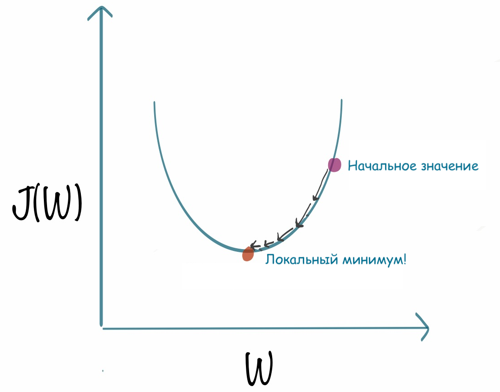

# Домашнее задание
## №1 Классика

Сделайте свой калькулятор: для этого реализуйте следующие функции  
1. `add(a, b)` - возвращает результат сложения a и b
2. `dif(a, b)` - возвращает результат вычитания a и b
3. `mul(a, b)` - возвращает результат умножения a и b
4. `div(a, b)` - возвращает результат деления a и b
5. 

Программа должна считывать примеры из файла и выводить ответы в другой файл. Один пример состоит из первого числа и дальше списка операций с другими числами.  

Пример: 2 +3 /4 *10 - 100. Программа должна взять первое число 2 а далее прибавить к нему 3 поделить результат на 4, умножить результат на 10 и 
вычесть 100.  
Пример файла: 
`2 +3 /4 *10 - 100` 
`4 -5 -5 -5 -5` 
`4 *10 -10 +54 /3` 
`2 +2 /7 -12 +100` 
Ответы программа должна выводить в файл: 
`-87.5` 
`-16` 
`82` 
`88,571428...`(и так далее, дальше писать лень) 

## №2 Поиск минимума
Очень рапространенной задачей во многих прикладых задачах (в том числе в обучении нейронных сетей) является поиск минимума функции. Реализуйте свою программу для решения этой задачи. 
1. Функция `func(a=2,b=3,c=4)` которая возвращает обратно функцию, которая уже в свою очередь принимает `x` и возвращает ax^2 + bx + c.
2. Функция `diff(f, delta=0.001)` которая считает производную функции `f` с заданной точностью. `delta` - некое маленькое число, производную считаем приблизительно по определению `f'(x) = (f(x+delta)-f(x))/delta`.
3. Функция `find_min(func, x_start=0)` которая ищет минимум функции с помощью производной.

Немного про поиск минимума функций с помощью производной. Сама по себе производная функции показывает растет ли функция в данной точке или убывает и с какой скоростью. Значит, если в текущей точке мы имеем положительную производную, значит функция растет и нам нужно двигаться в обратную сторону, то есть уменьшать `x`. Иначе, если производная отрицательная в текущей точке, то нам нужно увеличивать `x`, так как по мере его увеличения функция убывает. В какой момент нам нужно остановиться? Если мы ищем минимум, то стоит двигаться до тех пор, пока значения функции уменьшаются по мере движения. Если на каком то шаге следующее полученное значение становиться больше, чем предыдущее, то мы останавливаемся. Шаг на который мы двигаемся тоже имеет значение. В данной задаче возьмем шаг равный `step = 0.01` и будем двигаться на `x = x - step*diff(x)`. (Если вы не были на занятии - просмотрите запись, буду говорить об этом задании на занятии). 

Коэффиценты `a b c` считываются из файла, пример файла:  
`3 4 2` 
`5 3 0` 
`10 10 2` 
`1 3 2` 
Результаты работы, а именно точку минимума и значение функции в этой точке вам нужно вывести в отдельный файл, пример: 
`x_min = 3.0, f_min = 5.0` 
`x_min = 2.25, f_min = 4.111` 
`x_min = 3.757, f_min = -1.111111` 
`x_min = 10.556, f_min = -2.223232` 

## №3 Доделать базу данных на функциях
Мы уже переписали часть нашей базы данных на функциях. Допишите оставшиеся функции и доделайте. (после занятия отметить сколько мы успели).